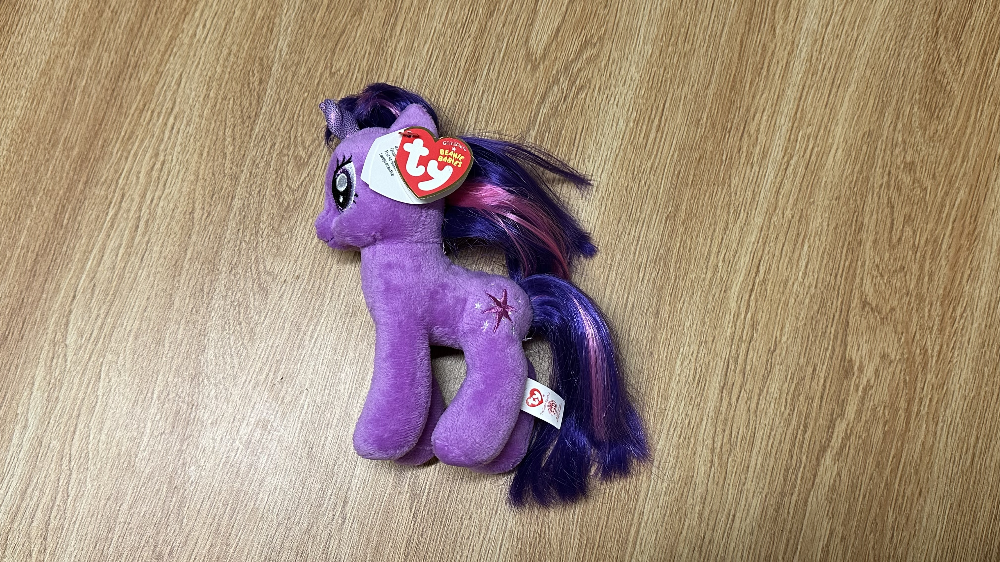
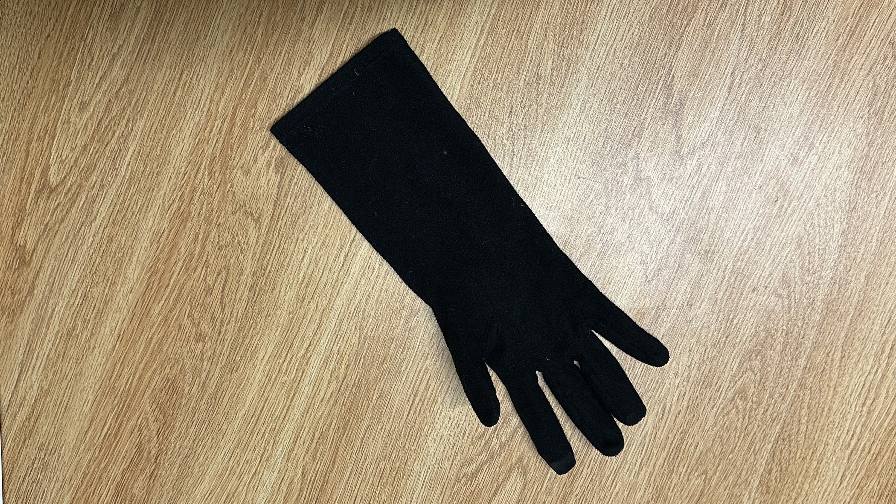
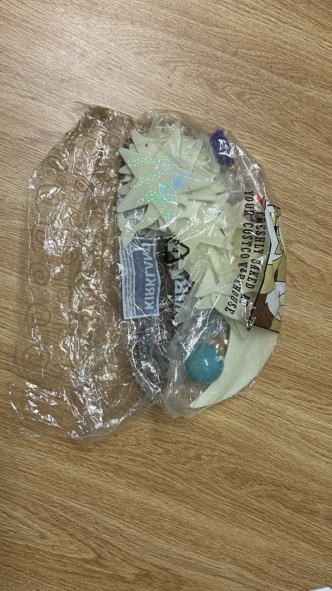
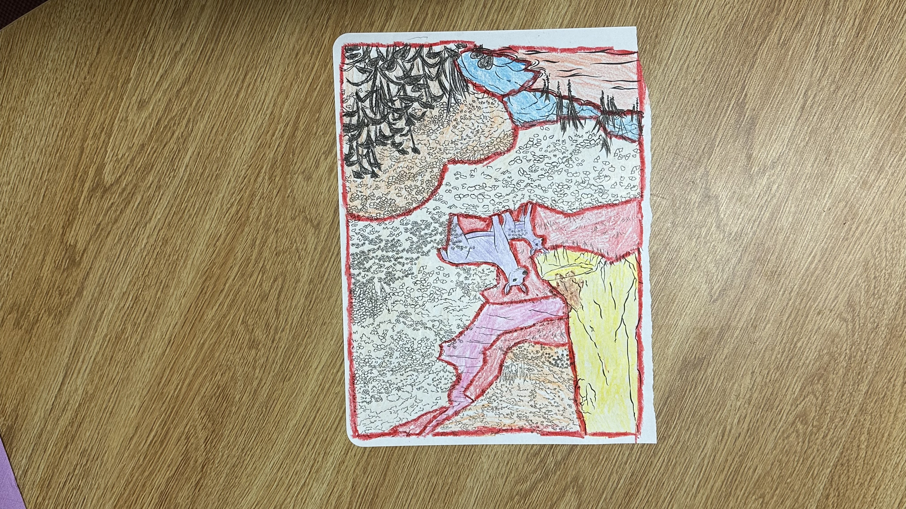
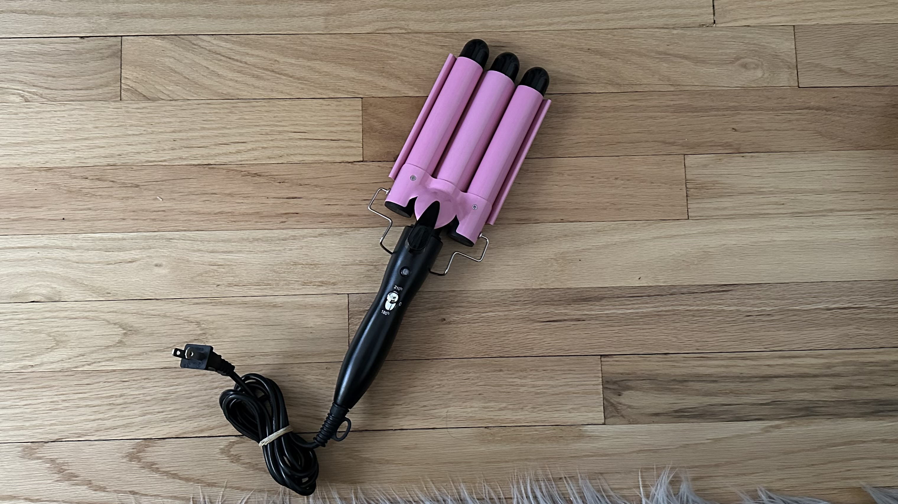
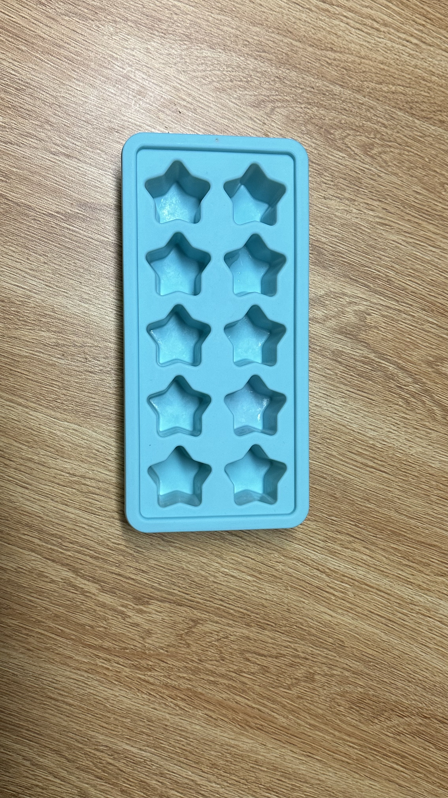
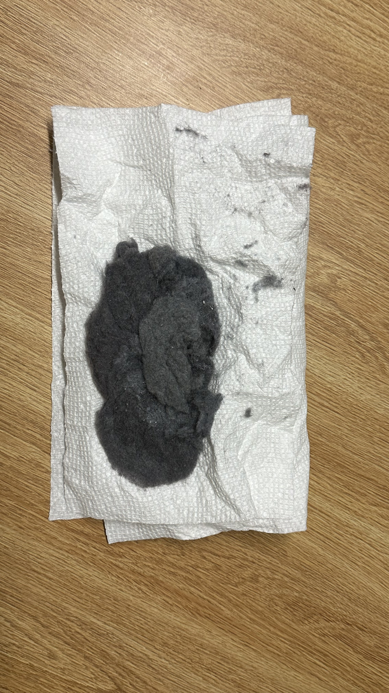
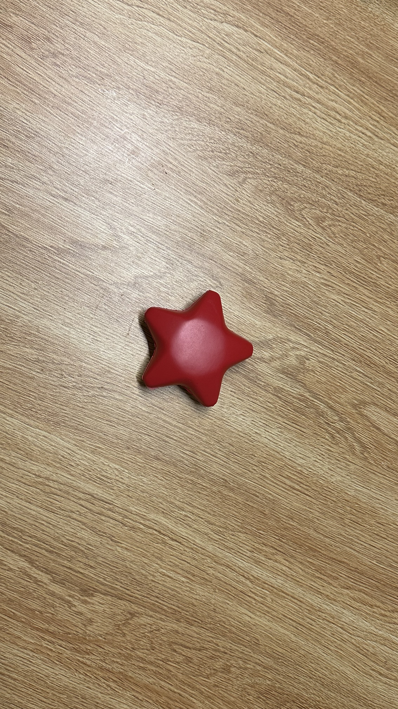
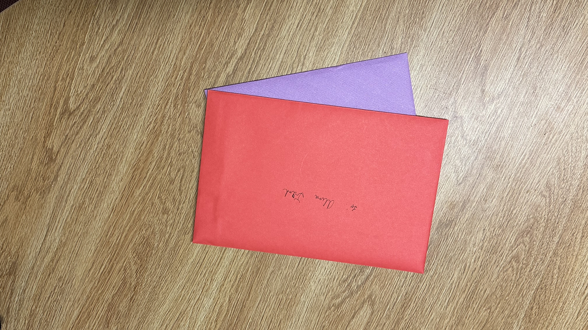
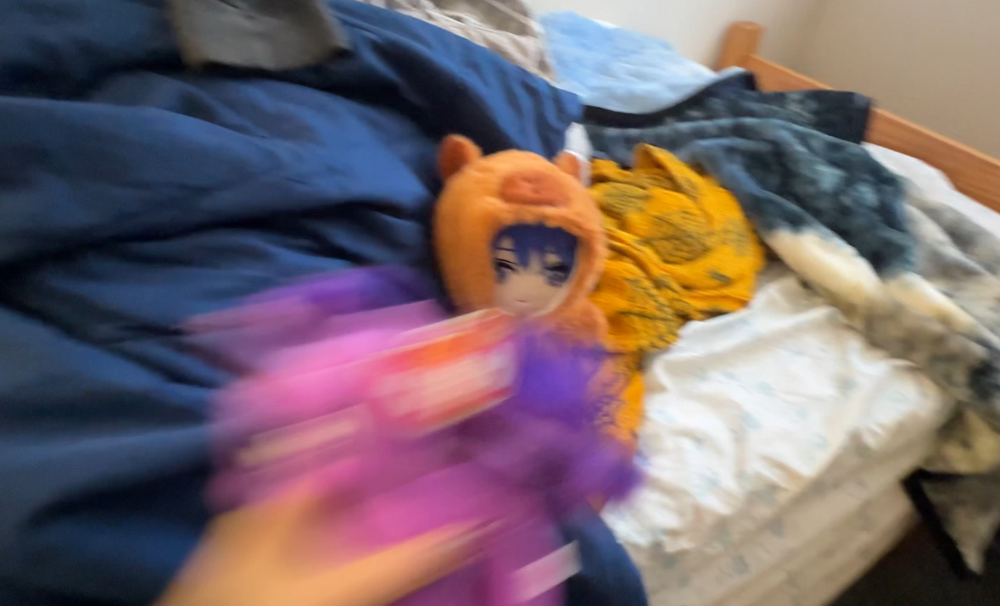

<!doctype html>
<html>
<head>
    <meta charset="UTF-8">
    <meta name="viewport" content="width=device-width, initial-scale=1.0">
    <title>Trash of the Week</title>
</head>

	
<body>
	<nav>
		<a href = "#">Home</a>
		<a href = "#reading.html">Reading</a>
		<a href = "#about">About</a>
		
	</nav>
	
    

         <h1>Week 1 - Where Did These Stars Come From?</h1>
		<nav>
			<a href = "#preface">Preface</a>
			<a href = "#overview">Overview</a>
			<a href = "#gallery">Gallery</a>
			<a href = "#profile">Profile</a>
			<a href = "#coda">Coda</a>
		</nav>
    

    

         <h2>Preface: Welcome</h2>
         
After taking an environmental science course this recent fall semester, I have decided to be a little more conscious of how I dispose of items. I have found that I oftentimes get confused about where certain items should be sent. Additionally, I have a bad habit of hoarding unnecessary items, something I believe happened through the environment I grew up in. So, by recording what I throw out each week,it may also help me declutter. I had already been trying to toss old items out here and there before the start of this so it’s unfortunate that I didn’t think of starting it sooner. It would have been nice to keep an archive of those items as well. If anything, this would help me improve more since in a way, I’ll be able to keep a memory of it digitally. The things I usually keep are items I believe will be of use later, or have some sort of sentimental value attached to them. I am a huge crafter, I’ve gone through hobbies such that use markers, paints, clays, and more; so at some point, I’ll have to go through a lot of supplies that probably won’t even work anymore, look forward to that!

		
    

         <h2>Overview: Let the Journey Begin!</h2>
         
As I was just starting out, I decided to start with some items I already knew had to go. They had been sitting around for months, and there were more items that piled up with them that I’ll record later on. After gathering my items, I actually noticed something that almost half of them had in common - the theme of stars. At first, I thought it was just the glow-in-the-dark stars, the stress toy, and my ice cube tray, but then I remembered the pony's name was Twilight Sparkle. I originally snapped the photo on the side that did not have her cutie mark on it (if you don’t know about My Little Pony, each pony has a talent that ends up being represented by a tattoo on their backside, which is called a cutie mark). So after I realized that, I just had to go back and take another photo with it in there.

	<h3>Bad Memory <em>[coloring page, cards, star stress toy, glove]</em>
</h3>
	
These items are all connected to times when I had issues with people. Although I held onto these simply because they were given to me or previously had use, it reminds me of those times and I don’t need that negativity to plague me. To begin with, we have a coloring page that my partner did during a club event. I thought it was super funny because he was trying to make it look as bad as possible. He actually didn’t want me to keep it from the beginning so it is better that I toss it out. Next, the cards are from people I don’t like, theres images of animals on them but I would rather not share it. These were given to me during christmas and my birthday. Next a red star stress toy was found under a couch in the building across from the Rutgers business building. I had been crying and when I went to move the seat to sit more comfortably I found this under it! It was comforting during it but again, its connected with the feelings so I decided to let go of it. Lastly there is the singular glove. It is black, soft, and warm (when they were new) I lost one of them during a walk and they were wearing down. It was during a particularly harsh week as well.

	<h3>Household Items <em>[ice cube tray, hair curler, lint]</em>
</h3>
	
Any household will typically have these items. Unless of course, you have an instant ice maker, someone with short hair, and don’t do your own laundry. I will argue though, that star ice cubes are so much better than normal ones. This one is blue and silicone but unfortunately, due to much use, there are holes in many of the molds. This was bought when I visited family in VietNam, originally to make a Vietnamese dessert called <a href="https://en.wikipedia.org/wiki/Agar" target="_blank">thạch</a>. Next up, this pink hair curler creates nice waves in your hair. It was gifted to me by my aunt, but I just find that using a normal hair straightener is easier to use. So it is in perfect condition, I decided to give it away to someone who would make use of it. Lastly there is some lint, that my roommate had left in the laundry. Lint is a hazard if you don’t remove it before dryer use so I had to trash it! I know its not really a sentimental item but I included it anyways as a little extra.

	<h3>Childhood Items <em>[glow in the dark stars, pony]</em>
</h3>
	
Growing up, these may have been something you owned. Every child always wanted to go to bed with glow in the dark stars littering their walls, I am no different. The only issue was when your ceiling wasn’t compatible with the provided stickers that keep them up and they fell down! These stars do as they are called - glow, and even after many years, they still have the same green glow from when they were just bought. Although they are a good memory, they no longer fit in the aesthetic of my room; however, I know someone that wanted these on their room wall, so I gave them away. As for the pony, even to this day the series is extremely popular. This toy is actually my roommates. It features a purple horse, with pink and purple hair. She got it as a present from another one of our friends. The most memorable moment was when I thought the hair was sitting oddly so I tried to straighten it and burnt off some hair. It is being donated due to the fact that I am replacing it.

    

	
	

	<h2>Gallery: My 9 Items for the Week</h2>
	
	
Twilight Sparkle: My Little Pony Plush

	
	
Single Glove

	
	
Glow-in-the-dark Stars

	
	
Coloring Page

	
	
Hair Curler

	
	
Ice Tray

	
	
Lint

	
	
Star Stress Toy

	
	
Cards

	
	

	
	<h2>Table:</h2>
	<table width="200" border="1">
  <tbody>
    <tr>
      <th scope="col">&nbsp;Item</th>
      <th scope="col">&nbsp;Weight</th>
      <th scope="col">&nbsp;Cost</th>
      <th scope="col">&nbsp;Source</th>
      <th scope="col">&nbsp;Location</th>
      <th scope="col">&nbsp;Owned</th>
      <th scope="col">&nbsp;Mode</th>
      <th scope="col">&nbsp;Color</th>
    </tr>
    <tr>
      <td>&nbsp;Pony</td>
      <td>&nbsp;80 grams</td>
      <td>&nbsp;$$</td>
      <td>&nbsp;Roommate #1</td>
      <td>&nbsp;Roommate's Bed</td>
      <td>&nbsp;4 Months</td>
      <td>&nbsp;Donated</td>
      <td>&nbsp;Purple</td>
    </tr>
    <tr>
      <td>&nbsp;Glove</td>
      <td>&nbsp;3 grams</td>
      <td>&nbsp;$</td>
      <td>&nbsp;Mom</td>
      <td>&nbsp;Floor</td>
      <td>&nbsp;5 Years</td>
      <td>&nbsp;Upcycled</td>
      <td>&nbsp;Black</td>
    </tr>
	  
    <tr>
      <td>&nbsp;Glow-in-the-dark-Stars</td>
      <td>&nbsp;160 grams</td>
      <td>&nbsp;$</td>
      <td>&nbsp;Mom</td>
      <td>&nbsp;Garage</td>
      <td>&nbsp;15 Years</td>
      <td>&nbsp;Donated</td>
      <td>&nbsp;Yellow</td>
    </tr>
	  
    <tr>
      <td>&nbsp;Coloring Page</td>
      <td>&nbsp;1 gram</td>
      <td>&nbsp;Free</td>
      <td>&nbsp;Club Event</td>
      <td>&nbsp;Desk</td>
      <td>&nbsp;2 Months</td>
      <td>&nbsp;Recycled</td>
      <td>&nbsp;Multicolor</td>
    </tr>
	  
    <tr>
      <td>&nbsp;Hair Curler</td>
      <td>&nbsp;1 Pound</td>
      <td>&nbsp;$$</td>
      <td>&nbsp;Aunt</td>
      <td>&nbsp;Storage Box</td>
      <td>&nbsp;6 Months</td>
      <td>&nbsp;Gifted</td>
      <td>&nbsp;Pink/Black</td>
    </tr>
	  
    <tr>
      <td>&nbsp;Ice Cube Tray</td>
      <td>&nbsp;70 grams</td>
      <td>&nbsp;$</td>
      <td>&nbsp;Mom</td>
      <td>&nbsp;Freezer</td>
      <td>&nbsp;10 Years</td>
      <td>&nbsp;Trashed</td>
      <td>&nbsp;Blue</td>
    </tr>
	  
    <tr>
      <td>&nbsp;Lint</td>
      <td>&nbsp;2 Grams</td>
      <td>&nbsp;Free</td>
      <td>&nbsp;Roommate #2</td>
      <td>&nbsp;Dryer</td>
      <td>&nbsp;5 Minutes</td>
      <td>&nbsp;Trashed</td>
      <td>&nbsp;Gray</td>
    </tr>
	  
	   <tr>
      <td>&nbsp;Star Stress Toy</td>
      <td>&nbsp;5 Grams</td>
      <td>&nbsp;Free</td>
      <td>&nbsp;Under Couch</td>
      <td>&nbsp;Kitchen Table</td>
      <td>&nbsp;3 Months</td>
      <td>&nbsp;Gifted</td>
      <td>&nbsp;Red</td>
    </tr>
	  
	   <tr>
      <td>&nbsp;Cards</td>
      <td>&nbsp;75 Grams</td>
      <td>&nbsp;Free</td>
      <td>&nbsp;Friends and Family</td>
      <td>&nbsp;Kitchen Table</td>
      <td>&nbsp;1 Month</td>
      <td>&nbsp;Recycled</td>
      <td>&nbsp;Red/Purple</td>
    </tr>
  </tbody>
</table>

	

	<h2>Profile: Item of the Week</h2>
	
I have decided to nominate the My Little Pony plush as my item of the week. Why? I believe theres a funny story behind it. I vaguely mentioned earlier that this toy does not belong to me. I also told you the story about how I burnt its hair trying to make it look more presentable for my roommate. This pony has been through a lot, and although its still clean and in okay shape, I decided that my roommate deserves better. So I have decided that donating this and buying her a new pony would be the plan. After all, I did ruin her hair. For now, it has been replaced by my plushie that she absolutely despises. You may be wondering, why? Well, it’s an inside joke, she’ll find out after a few days but I’ll make her believe that my plushie is the replacement. 

	
The pony is made with a fleece material and the hair with synthetic plastic material. The embroidery of the stars is done by machine because there are likely hundreds produced with it. As with many items, it is manufactured in China, and the production was initiated by <a href="https://en.wikipedia.org/wiki/Hasbro" target="_blank">Hasbro</a>- the company that has the copyright to the series. In terms of culture, it had a massive impact on the fan space in the early 2010s, fans of the show made many fan animations, music, and more. One of the most infamous songs inspired by the show is <a href="https://youtu.be/lSE1Nv-ivdc?si=fgrKCO5AtqWHDkCx" target="_blank">“Discord”</a> by The Living Tombstone. As it is a childrens toy, the material is made generally safe, except for the hair due to its plastic material which will not break down easily.
  

	
	<h3>Three Reasons Why I chose this Item</h3>
	
	<ol>
	<li>My roommate deserves worse.</li>
	<li>It's from a series I like and couldn't bare trashing something that could still be enjoyed by a child</li>
	<li>yes</li>
	</ol>
	
	
	

	
	

	<h2>Coda: Thank You</h2>
	
Thank you so much for joining me on this journey of being more conscious and getting over a bad habit, hopefully you continue to check back as I can find it in myself to get rid of some more difficult items of value. My goal overall is to finally have the ability to live a more minimalist life. Since I currently live with my parents and will eventually move out, I just don’t want to carry everything with me, so I think this will help a lot. Perhaps I will still be continuing this project during the move- out and the activity on this account will increase, who knows. Anyways, please consider signing up to receive updates and I’ll see you all next time!

	

</body>
</html>

